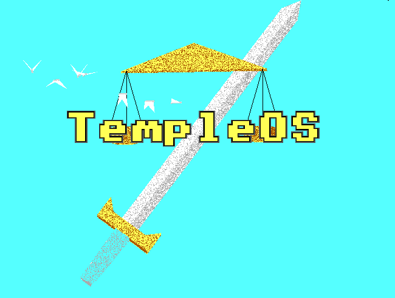

  

 

  

 

  

 

# 🐧 Distros I've Tried

## 🏹 Arch-based

  
  
  
  
  
  
  
  

## 🌀 Debian-based

  
  
  

## 🟠 Ubuntu-based

  
  
  
  
  
  

## 🔵 Fedora-based

  
  
  
  

## 🏢 Enterprise / RHEL

  
  

## 🧬 Gentoo-based

  
  

## 🧊 Other

  
  
  
  

## 🪟 Custom Windows

  
  
  
  
  
  
  

## 🐡 BSD

  
  

## ⛪ TempleOS

  

 

# 🌐 Where to Find Me

  
  
  

  

